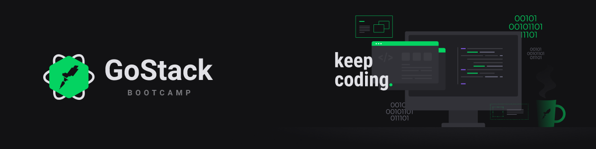

<h1 align="center">
    Desafio Conceitos do ReactJS
</h1>

## :rocket: Tecnologias

<p float="left">
  
  
  
</p>

-  [JavaScript](https://www.w3schools.com/js/)
-  [ReactJS](https://pt-br.reactjs.org/)
-  [Node.js](https://nodejs.org/en/)

## :boom: Como Executar

- ### **Pré-requisitos**

  - É **necessário** possuir o **[Node.js](https://nodejs.org/en/)** instalado.
  - É **necessário** possuir o **[Git](https://git-scm.com/)** instalado e configurado.
  - É **necessário** ter um gerenciador de pacotes seja o **[NPM](https://www.npmjs.com/)** ou **[Yarn](https://yarnpkg.com/)**.
  

1. Faça um clone do repositório do back-end:

```sh
  $ git clone https://github.com/ianbmesquita/desafio-conceitos-nodejs.git
```

2. Executando a API:

```sh
  # Acessando o diretório da API.
  $ cd desafio-conceitos-nodejs

  # Instalando as dependências do projeto.
  $ yarn # ou npm install

  # Inicializando o servidor node.
  $ yarn dev	
```

3. Faça um clone do repositório do front-end:

 ```sh
  $ git clone https://github.com/ianbmesquita/desafio-conceitos-reactjs.git
```

4. Executando a Aplicação:

```sh
  # Acessando o diretório da aplicação.
  $ cd desafio-conceitos-reactjs

  # Instalando as dependências do projeto.
  $ yarn # ou npm install

  # Inicializando o servidor reactjs.
  $ yarn dev	
```


## :memo: Licença

Esse projeto está sob a licença MIT. Veja o arquivo [LICENSE](LICENSE) para mais detalhes.

---
<sup>Projeto desenvolvido com a tutoria de [Diego Fernandes](https://github.com/diego3g), da [Rocketseat](rocketseat.com.br).</sup>
